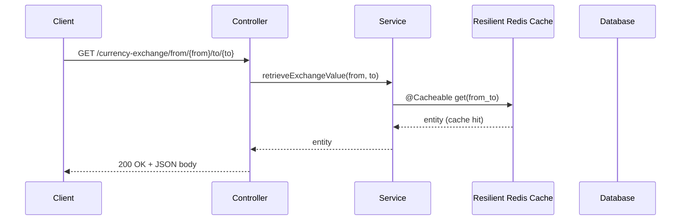
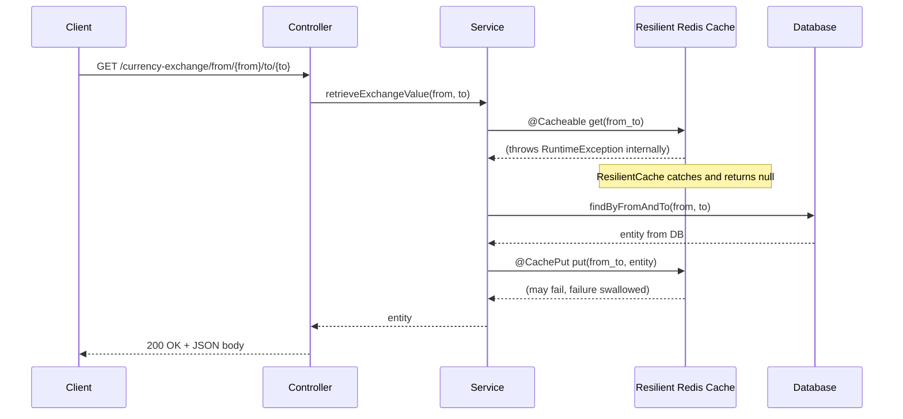
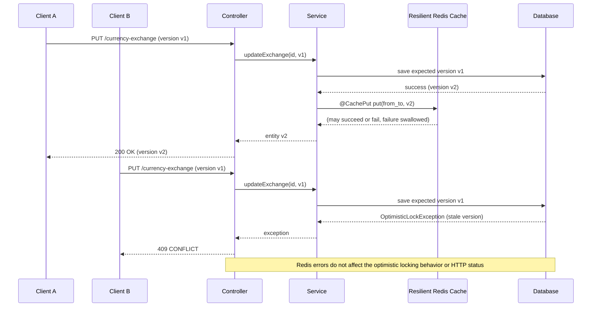

# Currency Exchange Service

## Concurrent PUT Handling and Cache Consistency

This service uses **optimistic locking** and **Redis-backed caching** to safely handle concurrent PUT requests that update `CurrencyExchange` entities.

### What problem does this solve?

When two or more clients (for example, two browsers) update the same currency exchange at the same time, naive implementations can suffer from **lost updates**:

- Client A reads the current value.
- Client B reads the same value.
- Client A updates and saves.
- Client B updates based on stale data and overwrites A's change.

The database and cache end up with B's values, silently discarding A's update.

### Solution Overview

1. **Optimistic locking on the entity**
   - The `CurrencyExchange` JPA entity has a `@Version` field:
     - Each update increments the version.
     - If a client tries to save an entity with an old version, the database rejects it and an optimistic locking exception is thrown.

2. **Service-layer update logic**
   - The `CurrencyExchangeService.updateExchange(Long id, CurrencyExchange currencyExchange)` method:
     - Loads the existing entity by `id`.
     - Ensures the `id` of the incoming entity is set.
     - Saves the entity, allowing JPA to enforce optimistic locking via the `@Version` field.
   - On concurrent updates, only the first commit succeeds; subsequent stale updates fail with an `OptimisticLockingFailureException`.

3. **Global exception handling**
   - `GlobalExceptionHandler` maps optimistic locking failures to HTTP `409 CONFLICT`:
     - Response body example:
       ```json
       {
         "error": "CONFLICT",
         "message": "CurrencyExchange has been modified by another request. Please reload and retry."
       }
       ```

4. **Redis cache consistency**
   - Reads use `@Cacheable(cacheNames = "exchangeValue", key = "#from + '_' + #to")`.
   - Creates and updates use `@CachePut` so that, after a successful database commit, the cache entry is refreshed with the latest state.
   - Deletes use `@CacheEvict` to remove entries for deleted exchanges.
   - The Redis cache manager is configured with a **locking writer** (`RedisCacheWriter.lockingRedisCacheWriter`) to avoid concurrent write races on the same cache key.

## Redis Fallback and Resilience

### Requirement

The service must continue to work even if Redis is down at startup or becomes unavailable while handling requests. Clients should still be able to read and update currency exchanges using the database, and no HTTP failures should be caused purely by cache issues. Once Redis is back, caching should resume automatically.

### Approach

1. **Database as the source of truth**
   - All business logic relies on the relational database via JPA.
   - Redis is treated as a best-effort performance optimization only.

2. **Resilient CacheManager and Cache decorator**
   - The `CacheConfig` defines a `RedisCacheManager` backed by `RedisCacheWriter.lockingRedisCacheWriter`.
   - This manager is wrapped in a `ResilientCacheManager` and `ResilientCache`:
     - On **cache read failures** (e.g., Redis down, timeout), the wrapper returns `null` so Spring treats it as a cache miss and calls the underlying repository (DB) logic.
     - On **cache write/evict failures**, the wrapper swallows the exception after logging; the database transaction result is still returned to the client.
   - If cache discovery itself fails (for example, Redis is fully unavailable during startup), `getCacheNames()` returns an empty list so the app still starts and operates purely against the DB.

3. **Interaction with method-level caching**
   - Service methods keep using Spring cache annotations:
     - `@Cacheable` for reads.
     - `@CachePut` for creates/updates.
     - `@CacheEvict` for deletes.
   - Because these annotations use the resilient cache wrapper, any Redis problem is contained at the cache layer and does not change service or controller behavior.

4. **Recovery behavior**
   - When Redis becomes healthy again, cache operations start succeeding without any code or configuration changes. No application restart is required.
   - **How it works internally:**
     1. The application uses the **Lettuce** Redis client (default in Spring Boot).
     2. Lettuce has built-in **transparent reconnection**. It constantly monitors the connection status.
     3. If Redis goes offline, Lettuce attempts to reconnect in the background.
     4. During downtime, the `ResilientCache` wrapper catches the connection exceptions and falls back to the DB.
     5. Once Lettuce successfully reconnects, the exceptions stop, and the `ResilientCache` automatically resumes updating and reading from Redis.

### Flow Diagrams (Mermaid)

#### Normal Flow with Cache Hit



#### Redis Down: Fallback to Database



#### Concurrent PUT with Redis Issues



## How to Run Tests

Run the full test suite (including concurrency tests):

```bash
./gradlew test
```

On Windows PowerShell:

```powershell
./gradlew.bat test
```

The `ConcurrencyUpdateTests` class verifies that a second save of a stale `CurrencyExchange` instance results in an `OptimisticLockingFailureException`, demonstrating that concurrent updates cannot silently overwrite each other.

Additional tests can be added to specifically simulate Redis failures while ensuring that service methods still return successful responses using the database as the fallback.
