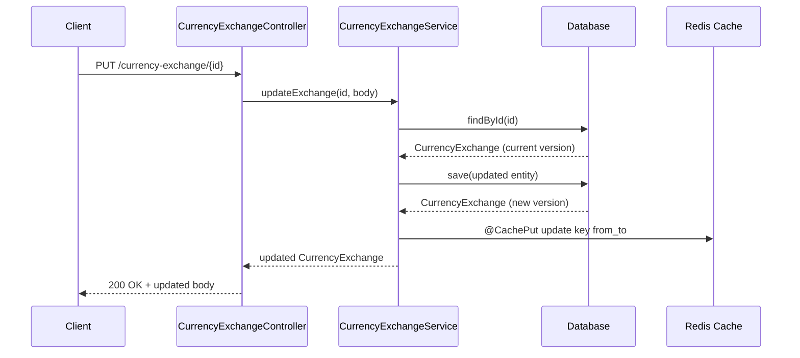
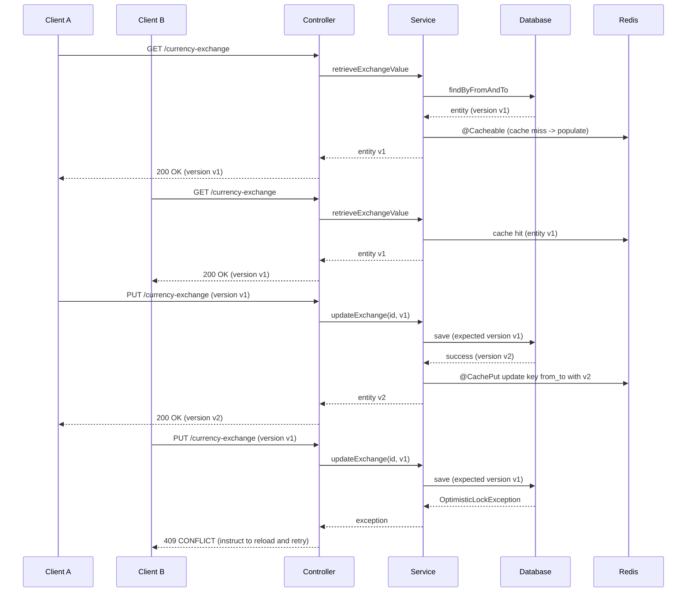

# Currency Exchange Service

## Concurrent PUT Handling and Cache Consistency

This service uses **optimistic locking** and **Redis-backed caching** to safely handle concurrent PUT requests that update `CurrencyExchange` entities.

### What problem does this solve?

When two or more clients (for example, two browsers) update the same currency exchange at the same time, naive implementations can suffer from **lost updates**:

- Client A reads the current value.
- Client B reads the same value.
- Client A updates and saves.
- Client B updates based on stale data and overwrites A's change.

The database and cache end up with B's values, silently discarding A's update.

### Solution Overview

1. **Optimistic locking on the entity**
   - The `CurrencyExchange` JPA entity has a `@Version` field:
     - Each update increments the version.
     - If a client tries to save an entity with an old version, the database rejects it and an optimistic locking exception is thrown.

2. **Service-layer update logic**
   - The `CurrencyExchangeService.updateExchange(Long id, CurrencyExchange currencyExchange)` method:
     - Loads the existing entity by `id`.
     - Ensures the `id` of the incoming entity is set.
     - Saves the entity, allowing JPA to enforce optimistic locking via the `@Version` field.
   - On concurrent updates, only the first commit succeeds; subsequent stale updates fail with an `OptimisticLockingFailureException`.

3. **Global exception handling**
   - `GlobalExceptionHandler` maps optimistic locking failures to HTTP `409 CONFLICT`:
     - Response body example:
       ```json
       {
         "error": "CONFLICT",
         "message": "CurrencyExchange has been modified by another request. Please reload and retry."
       }
       ```

4. **Redis cache consistency**
   - Reads use `@Cacheable(cacheNames = "exchangeValue", key = "#from + '_' + #to")`.
   - Creates and updates use `@CachePut` so that, after a successful database commit, the cache entry is refreshed with the latest state.
   - Deletes use `@CacheEvict` to remove entries for deleted exchanges.
   - The Redis cache manager is configured with a **locking writer** (`RedisCacheWriter.lockingRedisCacheWriter`) to avoid concurrent write races on the same cache key.

### Normal PUT Flow (Single Client)

1. Client sends `PUT /currency-exchange/{id}` with a JSON body representing `CurrencyExchange` (including the current `version` when exposed).
2. `CurrencyExchangeController.updateExchange` delegates to `CurrencyExchangeService.updateExchange`.
3. Service:
   - Loads the existing `CurrencyExchange` from the database by `id`.
   - Applies incoming changes.
   - Saves the entity.
   - JPA checks the `version` and increments it if the update succeeds.
4. Cache:
   - `@CachePut` updates the `exchangeValue` cache for key `from_to` with the new entity.
5. Controller returns `200 OK` with the updated `CurrencyExchange`.

### Concurrent PUT Race (Two Clients)

**Scenario:** Clients A and B both try to update the same `CurrencyExchange`.

1. **Both clients read the same state**
   - A and B both GET `/currency-exchange/from/{from}/to/{to}` and see the same `version` and values.

2. **Client A updates first**
   - A sends PUT with the current `version` and new data.
   - Service saves successfully; JPA increments the `version`.
   - `@CachePut` updates Redis with the new entity.

3. **Client B updates using stale data**
   - B sends PUT with the now-stale `version`.
   - When saving, JPA detects that the database row has a different `version` than expected and throws an optimistic locking exception.
   - `GlobalExceptionHandler` converts this to HTTP `409 CONFLICT`.
   - The cache remains at A's successfully updated value.

### Sequence Diagrams (Mermaid)

#### Normal Successful PUT



#### Concurrent PUT with Conflict



### How to Run Tests

Run the full test suite (including concurrency tests):

```bash
./gradlew test
```

On Windows PowerShell:

```powershell
./gradlew.bat test
```

The `ConcurrencyUpdateTests` class verifies that a second save of a stale `CurrencyExchange` instance results in an `OptimisticLockingFailureException`, demonstrating that concurrent updates cannot silently overwrite each other.

